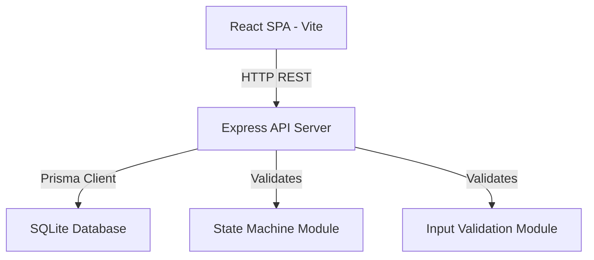

# Design Document: Support Ticket Management

## Overview

Internal support ticket management system with React SPA frontend, Node.js/Express REST API backend, and SQLite database accessed through Prisma ORM. Users create tickets, transition them through a defined state machine, add comments, and search/filter the ticket list.

Key design decisions:
- Monorepo structure with `client/` and `server/` directories
- State machine logic centralized in a dedicated module (not spread across routes)
- Prisma handles schema, migrations, and seeding
- No authentication — users are seeded and selected via dropdown

## Architecture



Three layers:

1. **Frontend (React + Vite)** — UI components, API client, state management via React Query
2. **Backend (Express)** — REST routes, validation middleware, state machine enforcement, Prisma queries
3. **Database (SQLite + Prisma)** — Schema definition, migrations, seed script

Communication: JSON over HTTP. Frontend calls backend REST endpoints. No WebSockets needed.

## Components and Interfaces

### Backend API Endpoints

| Method | Path | Purpose |
|--------|------|---------|
| POST | `/api/tickets` | Create ticket |
| GET | `/api/tickets` | List tickets (with search/filter query params) |
| GET | `/api/tickets/:id` | Get ticket details with comments |
| PATCH | `/api/tickets/:id` | Update ticket fields |
| POST | `/api/tickets/:id/transitions` | Transition ticket status |
| POST | `/api/tickets/:id/comments` | Add comment to ticket |
| GET | `/api/users` | List seeded users |

### Request/Response Shapes

**POST /api/tickets**
```json
// Request
{ "title": "string", "description": "string", "priority": "Low|Medium|High|Critical", "createdBy": "userId" }
// Response 201
{ "id": "string", "title": "...", "status": "Open", "priority": "...", "createdBy": "...", "assignedTo": null, "createdAt": "...", "updatedAt": "..." }
// Response 400
{ "errors": [{ "field": "title", "message": "Title is required" }] }
```

**GET /api/tickets?search=keyword&status=Open**
```json
// Response 200
{ "tickets": [{ "id": "...", "title": "...", "priority": "...", "status": "...", "assignedTo": "...", "updatedAt": "..." }] }
```

**GET /api/tickets/:id**
```json
// Response 200
{ "id": "...", "title": "...", "description": "...", "priority": "...", "status": "...", "assignedTo": "...", "createdBy": "...", "createdAt": "...", "updatedAt": "...", "comments": [{ "id": "...", "message": "...", "createdBy": "...", "createdAt": "..." }] }
// Response 404
{ "error": "Ticket not found" }
```

**PATCH /api/tickets/:id**
```json
// Request (partial)
{ "title": "new title", "assignedTo": "userId" }
// Response 200 — full ticket object
// Response 400 — validation errors
```

**POST /api/tickets/:id/transitions**
```json
// Request
{ "toStatus": "In Progress" }
// Response 200 — full ticket object with new status
// Response 400
{ "error": "Invalid transition from Open to Resolved" }
```

**POST /api/tickets/:id/comments**
```json
// Request
{ "message": "string", "createdBy": "userId" }
// Response 201
{ "id": "...", "message": "...", "createdBy": "...", "createdAt": "..." }
// Response 400
{ "errors": [{ "field": "message", "message": "Message is required" }] }
```

### State Machine Module

```typescript
// server/src/stateMachine.ts

const VALID_TRANSITIONS: Record<string, string[]> = {
  Open: ["In Progress", "Cancelled"],
  "In Progress": ["Resolved", "Cancelled"],
  Resolved: ["Closed"],
  Closed: [],
  Cancelled: [],
};

function canTransition(from: string, to: string): boolean {
  return VALID_TRANSITIONS[from]?.includes(to) ?? false;
}

function getValidTransitions(currentStatus: string): string[] {
  return VALID_TRANSITIONS[currentStatus] ?? [];
}
```

### Input Validation Module

Express middleware using a lightweight validation approach (manual or zod). Validates:
- Ticket creation: title (non-empty string), description (non-empty string), priority (enum), createdBy (valid user ID)
- Ticket update: at least one field provided, fields that are present must be valid
- Comment creation: message (non-empty string), createdBy (valid user ID)
- Transition: toStatus is a valid status string

### Frontend Components

```
client/src/
├── App.tsx                    — Router setup
├── api/                       — API client functions
│   └── tickets.ts
├── components/
│   ├── TicketList.tsx         — Table/list of tickets
│   ├── TicketDetail.tsx       — Full ticket view with comments
│   ├── TicketForm.tsx         — Create/edit ticket form
│   ├── CommentList.tsx        — Chronological comment display
│   ├── CommentForm.tsx        — Add comment input
│   ├── StatusBadge.tsx        — Color-coded status display
│   ├── TransitionButtons.tsx  — Valid next-status actions
│   ├── SearchFilter.tsx       — Search bar + status filter dropdown
│   └── ErrorMessage.tsx       — Accessible error display
├── hooks/
│   └── useTickets.ts          — React Query hooks
└── types/
    └── index.ts               — Shared TypeScript types
```

## Data Models

### Prisma Schema

```prisma
model User {
  id    String @id @default(uuid())
  name  String
  email String @unique
  role  String @default("agent")

  createdTickets  Ticket[]  @relation("TicketCreator")
  assignedTickets Ticket[]  @relation("TicketAssignee")
  comments        Comment[]
}

model Ticket {
  id          String   @id @default(uuid())
  title       String
  description String
  priority    String   // Low, Medium, High, Critical
  status      String   @default("Open")
  createdAt   DateTime @default(now())
  updatedAt   DateTime @updatedAt

  createdBy   String
  creator     User     @relation("TicketCreator", fields: [createdBy], references: [id])

  assignedTo  String?
  assignee    User?    @relation("TicketAssignee", fields: [assignedTo], references: [id])

  comments    Comment[]
}

model Comment {
  id        String   @id @default(uuid())
  message   String
  createdAt DateTime @default(now())

  ticketId  String
  ticket    Ticket   @relation(fields: [ticketId], references: [id])

  createdBy String
  author    User     @relation(fields: [createdBy], references: [id])
}
```

### Project Directory Structure

```
support-ticket-management/
├── client/
│   ├── package.json
│   ├── vite.config.ts
│   ├── index.html
│   └── src/
│       ├── main.tsx
│       ├── App.tsx
│       ├── api/
│       ├── components/
│       ├── hooks/
│       └── types/
├── server/
│   ├── package.json
│   ├── tsconfig.json
│   ├── prisma/
│   │   ├── schema.prisma
│   │   └── seed.ts
│   ├── src/
│   │   ├── index.ts          — Express app entry
│   │   ├── routes/
│   │   │   ├── tickets.ts
│   │   │   ├── comments.ts
│   │   │   └── users.ts
│   │   ├── stateMachine.ts
│   │   ├── validation.ts
│   │   └── errors.ts
│   └── tests/
│       └── integration/
│           └── stateMachine.test.ts
├── .env.example
├── .gitignore
└── README.md
```


## Correctness Properties

*A property is a characteristic or behavior that should hold true across all valid executions of a system — essentially, a formal statement about what the system should do. Properties serve as the bridge between human-readable specifications and machine-verifiable correctness guarantees.*

### Property 1: New tickets always start Open

*For any* valid ticket creation payload (non-empty title, non-empty description, valid priority, valid createdBy), the created ticket's status shall be "Open".

**Validates: Requirements 1.1**

### Property 2: Missing required ticket fields yield 400

*For any* ticket creation payload where at least one required field (title, description, priority, createdBy) is missing or empty, the backend shall respond with HTTP 400 and a non-empty errors array.

**Validates: Requirements 1.2, 9.1**

### Property 3: Ticket list is ordered by updatedAt descending

*For any* set of tickets in the database, the GET /api/tickets response shall return them sorted such that each ticket's updatedAt is >= the next ticket's updatedAt.

**Validates: Requirements 2.2**

### Property 4: Non-existent ticket returns 404

*For any* ticket ID that does not exist in the database, GET /api/tickets/:id shall return HTTP 404.

**Validates: Requirements 3.2**

### Property 5: Valid ticket updates persist and bump updatedAt

*For any* existing ticket and valid partial update (title, description, priority, or assignedTo), after PATCH the persisted ticket shall reflect the new values, and updatedAt shall be >= the previous updatedAt.

**Validates: Requirements 4.1**

### Property 6: Invalid ticket updates yield 400

*For any* ticket update payload containing an empty title or invalid priority value, the backend shall respond with HTTP 400.

**Validates: Requirements 4.2**

### Property 7: Valid state machine transitions succeed

*For any* (fromStatus, toStatus) pair in the set {(Open, In Progress), (Open, Cancelled), (In Progress, Resolved), (In Progress, Cancelled), (Resolved, Closed)}, transitioning a ticket with currentStatus=fromStatus to toStatus shall succeed and persist the new status.

**Validates: Requirements 5.1, 5.2, 5.3, 5.4, 5.5**

### Property 8: Invalid state machine transitions are rejected

*For any* (fromStatus, toStatus) pair NOT in the valid transitions set, attempting the transition shall return HTTP 400 with an error message identifying the invalid transition.

**Validates: Requirements 5.6**

### Property 9: Frontend presents only valid next-status options

*For any* ticket status, the set of transition options displayed by the frontend shall exactly equal the valid transitions defined in the state machine for that status.

**Validates: Requirements 5.8**

### Property 10: Valid comment creation persists

*For any* existing ticket and valid comment payload (non-empty message, valid createdBy), the comment shall be created, associated with the ticket, and retrievable.

**Validates: Requirements 6.1**

### Property 11: Invalid comment creation yields 400

*For any* comment creation payload where message is empty/whitespace or createdBy is missing, the backend shall respond with HTTP 400.

**Validates: Requirements 6.2, 9.2**

### Property 12: Comments are chronologically ordered

*For any* ticket with multiple comments, retrieving the ticket's comments shall return them sorted by createdAt ascending (oldest first).

**Validates: Requirements 6.4**

### Property 13: Search and filter returns only matching tickets

*For any* combination of keyword search and status filter, every ticket in the response shall: (a) contain the keyword in title or description (case-insensitive) if keyword is provided, AND (b) have the specified status if status filter is provided. No ticket matching all criteria shall be excluded.

**Validates: Requirements 7.1, 7.2, 7.3**

### Property 14: Data persistence round trip

*For any* ticket or comment created via the API, after application restart, querying for that entity shall return the same data.

**Validates: Requirements 8.4**

### Property 15: Validation errors list all failures

*For any* request with multiple validation failures, the 400 response shall contain an error entry for each invalid field (not just the first one found).

**Validates: Requirements 9.3**

### Property 16: Invalid priority values are rejected

*For any* string not in {Low, Medium, High, Critical}, submitting it as a priority in ticket creation shall return HTTP 400.

**Validates: Requirements 9.4**

### Property 17: Frontend blocks API calls when client-side validation fails

*For any* form submission attempt (ticket create, ticket update, comment create) where at least one client-side validation rule fails (missing required field, empty/whitespace-only string, invalid priority enum value), the Frontend SHALL NOT issue an API request, SHALL display the corresponding field-level error message, and SHALL keep the submit control disabled while errors are present.

**Validates: Requirements 13.1, 13.2, 13.3, 13.4**

## Error Handling

### Backend Error Strategy

- **Validation errors (400)**: Return `{ errors: [{ field, message }] }` array listing all invalid fields
- **Not found (404)**: Return `{ error: "Ticket not found" }` or similar entity-specific message
- **Invalid transition (400)**: Return `{ error: "Invalid transition from X to Y" }`
- **Server errors (500)**: Catch unhandled exceptions in error middleware, log full error server-side, return `{ error: "Internal server error" }` to client
- **Prisma errors**: Map known Prisma error codes (P2025 for not found, P2002 for unique constraint) to appropriate HTTP status codes

### Frontend Error Strategy

- **Network errors** (fetch throws): Display "Unable to connect to server. Check your connection."
- **4xx responses**: Parse response body, display field-level errors on forms or banner messages for non-form errors
- **5xx responses**: Display "Something went wrong. Please try again later."
- **Error display**: Use a dedicated `ErrorMessage` component with WCAG 2.1 AA compliant contrast, role="alert" for screen readers
- **Optimistic updates**: Not used — wait for server confirmation to avoid inconsistent state

### Express Error Middleware

```typescript
// server/src/errors.ts
class AppError extends Error {
  constructor(public statusCode: number, public errors: Array<{ field?: string; message: string }>) {
    super(errors.map(e => e.message).join(", "));
  }
}

// Global error handler middleware
function errorHandler(err, req, res, next) {
  if (err instanceof AppError) {
    return res.status(err.statusCode).json({ errors: err.errors });
  }
  console.error(err);
  res.status(500).json({ error: "Internal server error" });
}
```

## Testing Strategy

### Dual Testing Approach

Both unit tests and property-based tests are required for comprehensive coverage.

### Unit Tests (vitest)

Focus on:
- Specific integration scenarios (Requirement 12: state machine integration tests)
- Edge cases: empty database, non-existent IDs, boundary values
- Error response format verification
- Frontend component rendering (React Testing Library)

### Property-Based Tests (fast-check + vitest)

Library: **fast-check** — mature PBT library for TypeScript/JavaScript.

Configuration:
- Minimum 100 iterations per property test
- Each test tagged with property reference comment

Properties to implement:
- **Property 2**: Generate random subsets of required fields to omit, verify 400
- **Property 3**: Generate random tickets with random updatedAt, verify ordering
- **Property 7**: For each valid (from, to) pair, create ticket at fromStatus, transition, verify
- **Property 8**: Generate random invalid (from, to) pairs, verify 400
- **Property 9**: For each status, verify getValidTransitions matches expected set
- **Property 13**: Generate random tickets and search terms, verify filter correctness
- **Property 15**: Generate payloads with multiple invalid fields, verify all reported
- **Property 16**: Generate random strings not in priority enum, verify 400

Tag format: `// Feature: support-ticket-management, Property {N}: {title}`

### Integration Tests (vitest + supertest)

Per Requirement 12:
- Create ticket, transition through each valid path, assert 200 + persisted status
- Attempt each invalid transition, assert 400 + error message
- Each test creates its own ticket via API (no shared state)

### Test File Structure

```
server/tests/
├── unit/
│   ├── stateMachine.test.ts
│   └── validation.test.ts
├── property/
│   ├── ticketCreation.property.test.ts
│   ├── stateMachine.property.test.ts
│   ├── search.property.test.ts
│   └── validation.property.test.ts
└── integration/
    └── stateMachine.integration.test.ts
```
